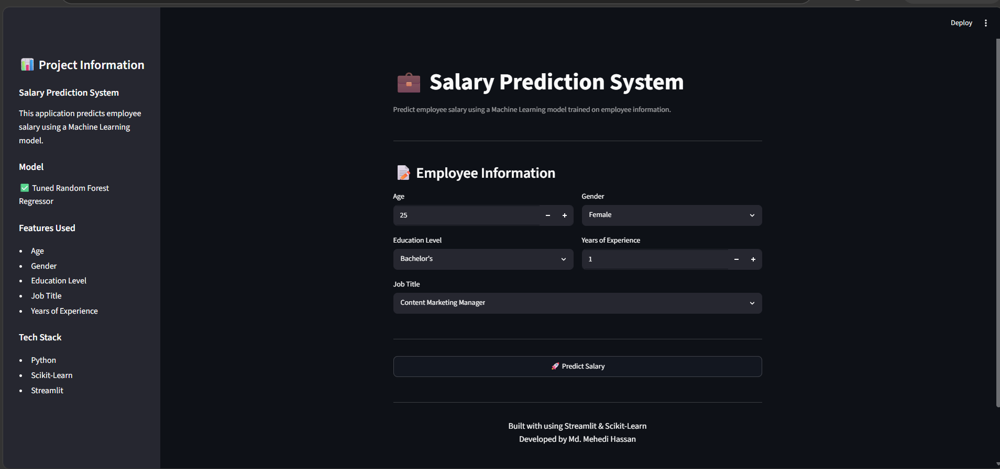
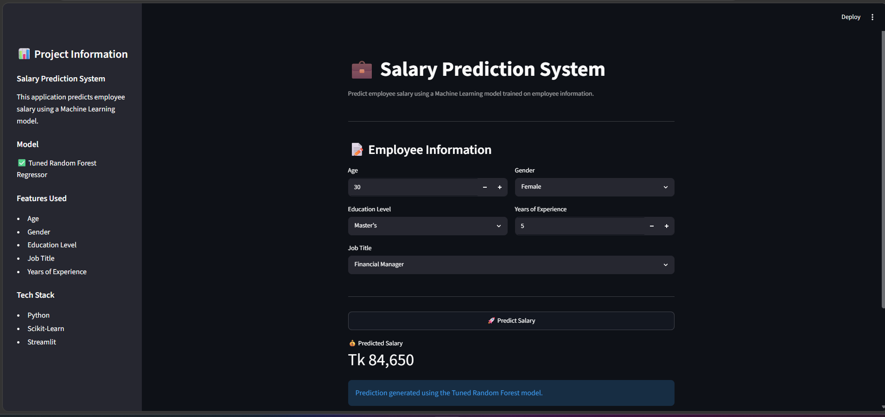
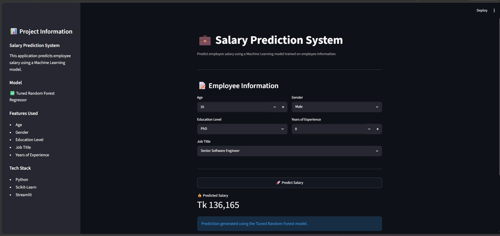

# 💼 Salary Prediction System

A Machine Learning project that predicts employee salaries based on demographic, educational, and professional information.

The project follows an end-to-end Machine Learning workflow including data preprocessing, feature engineering, model training, hyperparameter tuning, evaluation, and deployment using Streamlit.

---

## 📌 Project Overview

This application predicts employee salaries using a tuned Random Forest Regression model.

The model learns patterns from:

- Age
- Gender
- Education Level
- Job Title
- Years of Experience

The final solution is deployed through a Streamlit web application where users can enter employee information and receive salary predictions instantly.

---

## 🚀 Features

✅ Data Cleaning & Preprocessing

✅ Missing Value Handling

✅ Duplicate Removal

✅ Category Standardization

✅ Rare Category Handling

✅ Feature Engineering

✅ Ordinal Encoding

✅ One-Hot Encoding

✅ Multiple Model Comparison

✅ Cross Validation

✅ Hyperparameter Tuning

✅ Model Selection

✅ Model Serialization

✅ Interactive Streamlit Web App

---

## 📊 Dataset Information

**Dataset Size**

- Rows: 1,746
- Columns: 6

### Features

| Feature | Description |
|----------|-------------|
| Age | Employee age |
| Gender | Gender of employee |
| Education Level | Bachelor's, Master's, PhD |
| Job Title | Employee designation |
| Years of Experience | Total work experience |
| Salary | Target variable |

---

## 🛠️ Data Preprocessing

The following preprocessing steps were applied:

### Missing Value Handling

- Removed rows containing missing values

### Duplicate Removal

- Removed duplicate records

### Education Level Cleaning

Standardized category names:

| Before | After |
|----------|----------|
| Bachelor's Degree | Bachelor's |
| Master's Degree | Master's |
| phD | PhD |

### Rare Category Handling

Job titles appearing less than 10 times were grouped into:

```text
Others
```

---

## ⚙️ Feature Engineering

### Ordinal Encoding

Education Level was encoded as:

| Education Level | Encoding |
|----------------|-----------|
| Bachelor's | 1 |
| Master's | 2 |
| PhD | 3 |

### One-Hot Encoding

Applied to:

- Gender
- Job Title

Resulting dataset shape:

```text
(1746, 46)
```

---

## 🤖 Models Evaluated

The following regression models were trained and compared:

1. Linear Regression
2. Decision Tree Regressor
3. Random Forest Regressor
4. Gradient Boosting Regressor
5. Extra Trees Regressor

---

## 📈 Model Performance

| Model | MAE | RMSE | R² Score |
|---------|---------|---------|---------|
| Linear Regression | 16910.03 | 23198.66 | 0.7903 |
| Decision Tree | 12739.05 | 21766.65 | 0.8154 |
| Random Forest | 11732.59 | 18128.10 | 0.8719 |
| Gradient Boosting | 14449.93 | 19857.20 | 0.8463 |
| Extra Trees | 11452.97 | 19229.72 | 0.8559 |

---

## 🔍 Cross Validation

Random Forest Cross Validation Scores:

```text
[0.9087, 0.8594, 0.8829, 0.8974, 0.8726]
```

Average CV Score:

```text
0.8842
```

Standard Deviation:

```text
0.0175
```

---

## 🎯 Hyperparameter Tuning

Randomized Search CV was used.

### Best Parameters

```python
RandomForestRegressor(
    n_estimators=300,
    min_samples_split=6,
    max_depth=None,
    random_state=42
)
```

### Tuned Model Performance

```text
MAE  : 11788.17
RMSE : 17850.31
R²   : 0.8758
```

---

## 🏆 Final Model

Selected Model:

```text
Random Forest Regressor
```

Reasons:

- Highest R² Score
- Lowest RMSE
- Strong Cross Validation Performance
- Good Generalization

---

## 📊 Feature Importance

Top Important Features:

1. Years of Experience
2. Age
3. Data Scientist
4. Data Analyst
5. Education Level

The most influential feature was:

```text
Years of Experience
```

---

## 🖥️ Streamlit Application

The project includes a Streamlit web application for real-time salary prediction.

### User Inputs

- Age
- Gender
- Education Level
- Job Title
- Years of Experience

### Output

Predicted Salary

---

## 📂 Project Structure

```text
salary-prediction-ml-project/
│
├── data/
│   ├── raw/
│   │   └── salary_data.csv
├── images/
│    ├── Homepage.png
│    ├── Salary1.png
│    ├── Salary2.png
│     
├── models/
│   └── best_model.pkl
│
├── notebooks/
│   └── EDA.ipynb
│
├── src/
│   ├── data_preprocessing.py
│   ├── feature_engineering.py
│   ├── train_model.py
│   └── evaluate_model.py
│
├── app.py
├── environment.yml
├── README.md
└── .gitignore
```

---

## ▶️ Installation

Clone the repository:

```bash
git clone <repository-link>
```

Move to project directory:

```bash
cd salary-prediction-ml-project
```

Create environment:

```bash
conda env create -f environment.yml
```

Activate environment:

```bash
conda activate salary-env
```

---

## ▶️ Run Application

```bash
streamlit run app.py
```

---

## 📸 Application Preview

## 📸 Application Preview

### Home Page



### Prediction Result





## 🔮 Future Improvements

- XGBoost Integration
- CatBoost Integration
- Advanced Feature Engineering
- Docker Deployment
- CI/CD Pipeline
- Cloud Deployment

---

## 👨‍💻 Author

**Md. Mehedi Hassan**

Machine Learning Enthusiast

GitHub: https://github.com/mehedi-hassan-dev

LinkedIn: https://www.linkedin.com/in/md-mehedi-hassan-dev/

---

## ⭐ Acknowledgements

This project was built for learning, portfolio development, and practical Machine Learning implementation using Python and Scikit-Learn.